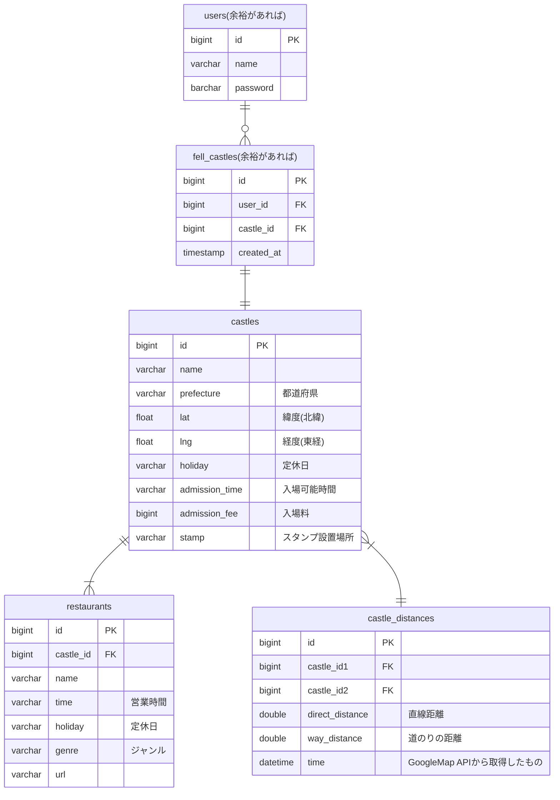

# API Document
## ER Diagram

## Endpoints
|Request Method|Route|Summary|
|---|---|---|
|GET|/ping|通信確認|
|GET|/castles|城の情報|
|GET|/castles/{castle_id}|城の詳細情報|
|POST|/travel|最短経路検索|
|POST|/user/signin|(時間があれば)ログイン|
|POST|/user/signup|(時間があれば)アカウント登録|
|GET|/log/{user_id}|(時間があれば)今まで落とした城|


- GET /castles
Response:
```json
[
    {
    "id": 0,
    "name": "string",
    "summary": "string",
    "url": "string",
    "lat": 0,
    "lng": 0
  }
]
```
- 
